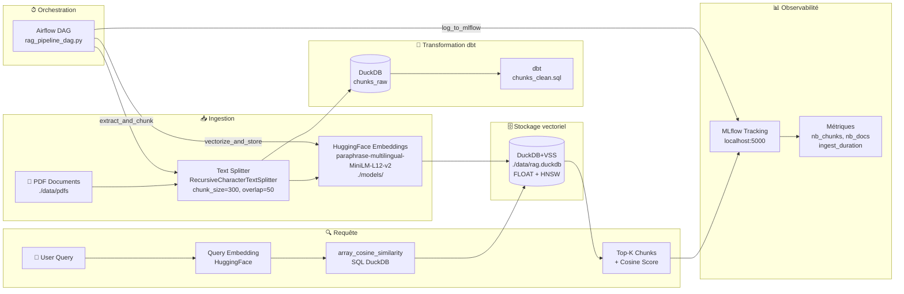

# RAG Pipeline

Pipeline de recherche sémantique sur documents PDF — LangChain, HuggingFace,
DuckDB+VSS, MLflow, dbt, Airflow.

---

## Problème métier

Retrouver une information précise dans un corpus de documents PDF
(notices réglementaires, contrats de bail, spécifications techniques)
sans parcourir chaque document manuellement.

Contexte : bailleur social disposant d'un volume important de documents
internes non structurés. L'objectif est d'interroger ce corpus en langage
naturel et d'obtenir les passages les plus pertinents avec un score de
confiance.

---

## Architecture



---

## Stack technique

| Outil | Rôle | Environnement |
|---|---|---|
| LangChain | Chargement PDF, découpage en chunks | `.venv` |
| HuggingFace sentence-transformers | Vectorisation multilingue FR/EN | `.venv` |
| DuckDB + extension VSS | Stockage vectoriel + recherche cosinus HNSW | `.venv` |
| dbt + DuckDB | Transformation et nettoyage des chunks | `.venv-dbt` |
| MLflow | Tracking des expériences et métriques | `.venv-mlflow` |
| Airflow | Orchestration du pipeline end-to-end | `.venv-airflow` — WSL2 requis |
| FastAPI | Exposition REST du pipeline | 🚧 À venir |
| Docker | Containerisation | 🚧 À venir |

---

## Structure du projet

```
rag-pipeline/
│
├── dags/
│   └── rag_pipeline_dag.py           # DAG Airflow : extract → vectorize → log
│
├── scripts/
│   ├── ingest.py                     # Chargement et découpage des PDFs
│   ├── embed.py                      # Vectorisation HuggingFace + stockage DuckDB+VSS
│   ├── query.py                      # Recherche par similarité cosinus SQL
│   ├── test_pipeline.py              # Validation end-to-end du pipeline RAG
│   ├── seed_duckdb.py                # Alimentation DuckDB avec chunks fictifs
│   └── test_mlflow.py                # Test de logging MLflow
│
├── dbt_project/                      # Couche transformation — indépendante du pipeline RAG
│   └── mon_rag_dbt/
│       ├── dbt_project.yml
│       └── models/
│           ├── chunks_clean.sql      # Nettoyage des chunks bruts
│           └── sources.yml
│
├── models/                           # Modèle HuggingFace en cache local (~117MB)
│   └── paraphrase-multilingual-MiniLM-L12-v2/
│
├── data/
│   ├── pdfs/                         # Documents PDF source
│   └── rag.duckdb                    # Base vectorielle DuckDB+VSS
│
├── requirements/
│   ├── requirements-rag.txt          # LangChain, HuggingFace, DuckDB, numpy
│   ├── requirements-mlflow.txt       # MLflow
│   ├── requirements-dbt.txt          # dbt-duckdb, duckdb
│   └── requirements-airflow.txt      # apache-airflow
│
├── tests/                            # 🚧 À venir
├── api/                              # 🚧 À venir — FastAPI
├── constraints-3.11.txt              # Contraintes pip pour Airflow
├── docker-compose.yaml               # 🚧 À venir
├── .env.example                      # Variables d'environnement (modèle)
└── .gitignore
```

---

## Installation

### Pipeline RAG — LangChain, HuggingFace, DuckDB+VSS

```powershell
python -m venv .venv
.\.venv\Scripts\Activate.ps1
pip install -r requirements/requirements-rag.txt
```

### MLflow

```powershell
python -m venv .venv-mlflow
.\.venv-mlflow\Scripts\Activate.ps1
pip install -r requirements/requirements-mlflow.txt
```

### dbt + DuckDB

```powershell
python -m venv .venv-dbt
.\.venv-dbt\Scripts\Activate.ps1
pip install -r requirements/requirements-dbt.txt
```

### Airflow (WSL2 requis)

```bash
python -m venv .venv-airflow
source .venv-airflow/bin/activate
pip install apache-airflow --constraint constraints-3.11.txt
```

---

## Lancer le projet

### Pipeline RAG — exécution manuelle

```powershell
# 1. Activer le venv principal
.\.venv\Scripts\Activate.ps1

# 2. Placer les PDFs dans data/pdfs/

# 3. Lancer le pipeline complet
python scripts/test_pipeline.py
```

### MLflow

```powershell
.\start_mlflow.ps1
# UI → http://localhost:5000
```

### dbt

```powershell
.\.venv-dbt\Scripts\Activate.ps1
cd dbt_project\mon_rag_dbt
dbt run
dbt docs serve --port 8081
# UI → http://localhost:8081
```

### Airflow

```bash
# Depuis WSL2 uniquement
source ~/rag-airflow-venv/bin/activate
export AIRFLOW_HOME=~/airflow
airflow webserver --port 8080
# UI → http://localhost:8080
```

---

## URLs locales

| Service | URL | Statut |
|---|---|---|
| MLflow UI | http://localhost:5000 | ✅ Fonctionnel |
| dbt docs | http://localhost:8081 | ✅ Fonctionnel |
| Airflow UI | http://localhost:8080 | ⚠️ WSL2 requis |
| FastAPI | http://localhost:8000 | 🚧 À venir |

---

## Résultats

> À compléter après exécution sur corpus réel (Étape 6 du plan d'action)

| Métrique | Valeur |
|---|---|
| Documents traités | — |
| Chunks générés | — |
| Temps d'ingestion (sec) | — |
| Temps de requête moyen (ms) | — |
| Score cosinus moyen (5 requêtes test) | — |

---

## Choix techniques

### DuckDB+VSS plutôt que Chroma

DuckDB avec l'extension VSS (Vector Similarity Search) remplace Chroma
comme base vectorielle. Ce choix unifie le stockage — chunks tabulaires
et vecteurs dans la même base — permet des requêtes SQL directes sur les
embeddings, et s'intègre nativement avec dbt. Pour un profil Data Engineer
orienté SQL et ETL, ce choix est plus naturel et lisible qu'une base
vectorielle opaque.

### Modèle multilingue

`paraphrase-multilingual-MiniLM-L12-v2` supporte le français et l'anglais,
ce qui correspond au contexte métier — documents réglementaires en français,
spécifications techniques en anglais.

### Venvs isolés

Chaque outil tourne dans un environnement virtuel dédié pour éviter les
conflits de dépendances, notamment entre Airflow (contraintes strictes sur
`sqlalchemy`, `protobuf`) et LangChain/MLflow (`pydantic`).

### dbt comme couche de transformation indépendante

Le projet dbt (`dbt_project/`) opère sur une base DuckDB distincte
(`dev.duckdb`) alimentée par `seed_duckdb.py`. Il est découplé du pipeline
RAG principal (`rag.duckdb`) et illustre la capacité à appliquer des
pratiques data engineering classiques (transformation, tests, documentation)
dans un contexte IA.

---

## État d'avancement

| Composant | Statut |
|---|---|
| Pipeline RAG local (ingest, embed, query) | ✅ Fonctionnel |
| DuckDB+VSS (stockage vectoriel) | ✅ Fonctionnel |
| MLflow (tracking des expériences) | ✅ Fonctionnel |
| dbt (transformation des chunks) | ✅ Fonctionnel |
| Airflow (orchestration) | ⚠️ WSL2 requis |
| API FastAPI | 🚧 À venir |
| Tests unitaires | 🚧 À venir |
| Docker | 🚧 À venir |