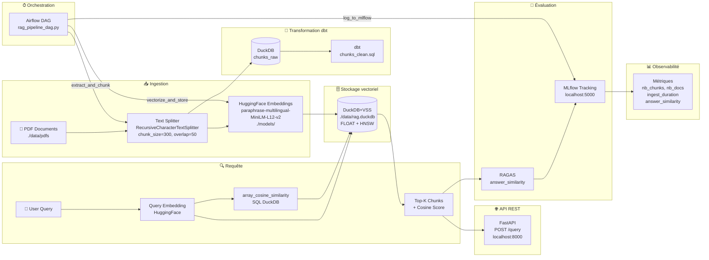

# RAG Pipeline

Pipeline de recherche sémantique sur documents PDF — LangChain, HuggingFace,
DuckDB+VSS, MLflow, dbt, Airflow.

---

## Problème métier

Retrouver une information précise dans un corpus de documents PDF
(notices réglementaires, contrats de bail, spécifications techniques)
sans parcourir chaque document manuellement.

Contexte : bailleur social disposant d'un volume important de documents
internes non structurés. L'objectif est d'interroger ce corpus en langage
naturel et d'obtenir les passages les plus pertinents avec un score de
confiance.

---

## Architecture


```mermaid
graph LR

    subgraph Ingestion["📥 Ingestion"]
        A[📄 PDF Documents\n./data/pdfs] --> B[Text Splitter\nRecursiveCharacterTextSplitter\nchunk_size=300, overlap=50]
        B --> C[HuggingFace Embeddings\nparaphrase-multilingual-MiniLM-L12-v2\n./models/]
    end

    subgraph Stockage["🗄️ Stockage vectoriel"]
        C --> D[(DuckDB+VSS\n./data/rag.duckdb\nFLOAT + HNSW)]
    end

    subgraph Transformation["🔧 Transformation dbt"]
        B --> E[(DuckDB\nchunks_raw)]
        E --> F[dbt\nchunks_clean.sql]
    end

    subgraph Query["🔍 Requête"]
        G[👤 User Query] --> H[Query Embedding\nHuggingFace]
        H --> I[array_cosine_similarity\nSQL DuckDB]
        H --> D
        I --> D
        D --> J[Top-K Chunks\n+ Cosine Score]
    end

    subgraph API["🌐 API REST"]
        J --> API1[FastAPI\nPOST /query\nlocalhost:8000]
    end

    subgraph Evaluation["🧪 Évaluation"]
        J --> R[RAGAS\nanswer_similarity]
        R --> K[MLflow Tracking\nlocalhost:5000]
    end

    subgraph Observabilite["📊 Observabilité"]
        K --> L[Métriques\nnb_chunks, nb_docs\ningest_duration\nanswer_similarity]
    end

    subgraph Orchestration["⏱ Orchestration"]
        M[Airflow DAG\nrag_pipeline_dag.py] -->|extract_and_chunk| B
        M -->|vectorize_and_store| C
        M -->|log_to_mlflow| K
    end
```

---

## Stack technique

| Outil | Rôle | Environnement |
|---|---|---|
| LangChain | Chargement PDF, découpage en chunks | `.venv` |
| HuggingFace sentence-transformers | Vectorisation multilingue FR/EN | `.venv` |
| DuckDB + extension VSS | Stockage vectoriel + recherche cosinus HNSW | `.venv` |
| dbt + DuckDB | Transformation et nettoyage des chunks | `.venv-dbt` |
| MLflow | Tracking des expériences et métriques | `.venv-mlflow` |
| RAGAS + Flan-T5-large | Évaluation qualité du pipeline RAG | `.venv-ragas` |
| Airflow | Orchestration du pipeline end-to-end | `.venv-airflow` — WSL2 requis |
| FastAPI + Uvicorn | Exposition REST du pipeline RAG | `.venv-api` |
| Docker | Containerisation | 🚧 À venir |

---

## Évaluation — RAGAS

Évaluation automatisée de la qualité du pipeline RAG via [RAGAS](https://docs.ragas.io),
en mode 100% local (aucune API externe).

| Métrique | LLM requis | Statut | Description |
|---|---|---|---|
| `answer_similarity` | ✅ Oui | ✅ Actif (0.41) | Similarité sémantique réponse générée / ground truth |
| `context_precision` | ✅ Oui | ⚠️ Timeout CPU | Les chunks récupérés sont-ils pertinents ? |
| `context_recall` | ✅ Oui | ⚠️ Timeout CPU | Le pipeline retrouve-t-il les bons passages ? |
| `faithfulness` | ✅ Oui | 🚧 À venir | Réponse fidèle aux chunks récupérés ? |
| `answer_relevancy` | ✅ Oui | 🚧 À venir | Réponse pertinente par rapport à la question ? |

**Embeddings :** `paraphrase-multilingual-MiniLM-L12-v2` (HuggingFace local)
**LLM juge :** `google/flan-t5-large` (local, CPU) — `answer_similarity` opérationnel (score moyen : 0.41).
`context_precision` et `context_recall` en attente — Flan-T5 trop lent en CPU (TimeoutError).
Roadmap : remplacement par Ollama (Mistral ou Llama3) pour évaluation complète.
**Résultats trackés dans MLflow** — expérience `ragas-evaluation`

```powershell
.\.venv-ragas\Scripts\Activate.ps1
python scripts/evaluate.py
```

---

## Perspectives & Roadmap

### Model Context Protocol (MCP)

Le pipeline RAG actuel est conçu pour évoluer vers une architecture **MCP (Model Context Protocol)**.

MCP est un protocole ouvert (Anthropic, 2024) qui standardise la communication
entre un LLM et ses sources de données ou outils externes. Il définit deux rôles :

| Rôle | Description | Dans ce projet |
|---|---|---|
| **MCP Server** | Expose des ressources ou outils interrogeables par un LLM | L'API FastAPI `/query` |
| **MCP Client** | Le LLM qui consomme les ressources exposées | Agent LangGraph |

**Évolution cible :**

```
[LLM Agent]
    │
    │  MCP Protocol
    ▼
[MCP Server — FastAPI]
    │
    ├── /query  → DuckDB+VSS (recherche sémantique)
    ├── /docs   → corpus PDF (accès aux sources)
    └── /health → monitoring
```

Cette architecture permet :
- Un accès **standardisé et sécurisé** aux connaissances du corpus
- Une **découplabilité** totale entre le LLM et les sources de données
- Une **extensibilité** vers d'autres knowledge connectors (bases SQL, APIs métier)

**Roadmap technique :**

| Composant | Statut | Description |
|---|---|---|
| API FastAPI `/query` | ✅ Livré | Base du MCP Server |
| Exposition MCP Server | 🚧 À venir | Wrapper MCP sur FastAPI via `mcp` SDK |
| Agent LangGraph | 🚧 À venir | MCP Client avec mémoire et multi-turn |
| Évaluation LLM complète | ⚠️ Partiel | Flan-T5 actif (answer_similarity) — Ollama requis pour métriques complètes |
| Conteneurisation Docker | 🚧 À venir | Image unifiée API + modèles |
| Tests unitaires | 🚧 À venir | Couverture pipeline RAG et endpoints API |

---

## Structure du projet

```
rag-pipeline/
│
├── dags/
│   └── rag_pipeline_dag.py           # DAG Airflow : extract → vectorize → log
│
├── scripts/
│   ├── ingest.py                     # Chargement et découpage des PDFs
│   ├── embed.py                      # Vectorisation HuggingFace + stockage DuckDB+VSS
│   ├── query.py                      # Recherche par similarité cosinus SQL
│   ├── test_pipeline.py              # Validation end-to-end du pipeline RAG
│   ├── seed_duckdb.py                # Alimentation DuckDB avec chunks fictifs
│   └── test_mlflow.py                # Test de logging MLflow
│
├── dbt_project/                      # Couche transformation — indépendante du pipeline RAG
│   └── mon_rag_dbt/
│       ├── dbt_project.yml
│       └── models/
│           ├── chunks_clean.sql      # Nettoyage des chunks bruts
│           └── sources.yml
│
├── models/                           # Modèle HuggingFace en cache local (~117MB)
│   └── paraphrase-multilingual-MiniLM-L12-v2/
│
├── data/
│   ├── pdfs/                         # Documents PDF source
│   └── rag.duckdb                    # Base vectorielle DuckDB+VSS
│
├── requirements/
│   ├── requirements-rag.txt
│   ├── requirements-mlflow.txt
│   ├── requirements-dbt.txt
│   ├── requirements-airflow.txt
│   ├── requirements-api.txt          # ✅ FastAPI
│   └── requirements-ragas.txt        # ✅ RAGAS
│
├── tests/                            # 🚧 À venir
├── api/                              # ✅ API REST FastAPI
│   ├── __init__.py
│   ├── main.py                       # Application FastAPI
│   └── models.py                     # Schémas Pydantic
├── constraints-3.11.txt              # Contraintes pip pour Airflow
├── docker-compose.yaml               # 🚧 À venir
├── .env.example                      # Variables d'environnement (modèle)
└── .gitignore
```

---

## Installation

> Les commandes d'activation de venv diffèrent selon l'OS :
> - **Windows** : `.\.venv\Scripts\Activate.ps1`
> - **macOS / Linux** : `source .venv/bin/activate`

### Pipeline RAG — LangChain, HuggingFace, DuckDB+VSS

```powershell
py -3.11 -m venv .venv
.\.venv\Scripts\Activate.ps1
pip install -r requirements/requirements-rag.txt
```

```bash
# macOS / Linux
python3.11 -m venv .venv
source .venv/bin/activate
pip install -r requirements/requirements-rag.txt
```

### MLflow

```powershell
py -3.11 -m venv .venv-mlflow
.\.venv-mlflow\Scripts\Activate.ps1
pip install -r requirements/requirements-mlflow.txt
```

```bash
# macOS / Linux
python3.11 -m venv .venv-mlflow
source .venv-mlflow/bin/activate
pip install -r requirements/requirements-mlflow.txt
```

### dbt + DuckDB

```powershell
py -3.11 -m venv .venv-dbt
.\.venv-dbt\Scripts\Activate.ps1
pip install -r requirements/requirements-dbt.txt
```

```bash
# macOS / Linux
python3.11 -m venv .venv-dbt
source .venv-dbt/bin/activate
pip install -r requirements/requirements-dbt.txt
```

### Airflow (WSL2 requis)

```powershell
py -3.11 -m venv .venv-airflow
source .venv-airflow/bin/activate
pip install apache-airflow --constraint constraints-3.11.txt
```

```bash
# macOS / Linux
python3.11 -m venv .venv-airflow
source .venv-airflow/bin/activate
pip install apache-airflow --constraint constraints-3.11.txt
```

### API FastAPI

```powershell
py -3.11 -m venv .venv-api
.\.venv-api\Scripts\Activate.ps1
pip install -r requirements/requirements-api.txt
```

```bash
# macOS / Linux
python3.11 -m venv .venv-api
source .venv-api/bin/activate
pip install -r requirements/requirements-api.txt
```

### Évaluation RAGAS

```powershell
py -3.11 -m venv .venv-ragas
.\.venv-ragas\Scripts\Activate.ps1
# PyTorch CPU (si métriques LLM activées)
pip install torch --index-url https://download.pytorch.org/whl/cpu
pip install -r requirements/requirements-ragas.txt
```

```bash
# macOS / Linux
python3.11 -m venv .venv-ragas
source .venv-ragas/bin/activate
pip install torch
pip install -r requirements/requirements-ragas.txt
```

---

## Lancer le projet

### Pipeline RAG — exécution manuelle

```powershell
# 1. Activer le venv principal
.\.venv\Scripts\Activate.ps1

# 2. Placer les PDFs dans data/pdfs/

# 3. Lancer le pipeline complet
python scripts/test_pipeline.py
```

```bash
# macOS / Linux
source .venv/bin/activate
# Placer les PDFs dans data/pdfs/
python scripts/test_pipeline.py
```

### MLflow

```powershell
.\.venv-mlflow\Scripts\Activate.ps1
mlflow ui --backend-store-uri sqlite:///D:/projets/rag-pipeline/mlflow_data/mlflow.db --port 5000
# UI → http://localhost:5000
# Arrêt : Ctrl+C
```

```bash
# macOS / Linux
source .venv-mlflow/bin/activate
mlflow ui --backend-store-uri sqlite:///$(pwd)/mlflow_data/mlflow.db --port 5000
# UI → http://localhost:5000
# Arrêt : Ctrl+C
```

### dbt

```powershell
.\.venv-dbt\Scripts\Activate.ps1
cd dbt_project\mon_rag_dbt
dbt run
dbt docs serve --port 8081
# UI → http://localhost:8081
```

```bash
# macOS / Linux
source .venv-dbt/bin/activate
cd dbt_project/mon_rag_dbt
dbt run
dbt docs serve --port 8081
# UI → http://localhost:8081
```

### Airflow

```powershell
# Depuis WSL2 uniquement
source ~/rag-airflow-venv/bin/activate
export AIRFLOW_HOME=~/airflow
airflow webserver --port 8080
# UI → http://localhost:8080
```

```bash
# macOS / Linux
source .venv-airflow/bin/activate
export AIRFLOW_HOME=$(pwd)/airflow
airflow webserver --port 8080
# UI → http://localhost:8080
```

### API FastAPI

```powershell
.\.venv-api\Scripts\Activate.ps1
uvicorn api.main:app --reload --port 8000
# Swagger UI → http://localhost:8000/docs
```

```bash
# macOS / Linux
source .venv-api/bin/activate
uvicorn api.main:app --reload --port 8000
# Swagger UI → http://localhost:8000/docs
# Arrêt : Ctrl+C
```

### Évaluation RAGAS

```powershell
.\.venv-ragas\Scripts\Activate.ps1
python scripts/evaluate.py
# Résultats → MLflow UI http://localhost:5000
```

```bash
# macOS / Linux
source .venv-ragas/bin/activate
python scripts/evaluate.py
# Résultats → MLflow UI http://localhost:5000
```

---

## URLs locales

| Service | URL | Statut |
|---|---|---|
| MLflow UI | http://localhost:5000 | ✅ Fonctionnel |
| dbt docs | http://localhost:8081 | ✅ Fonctionnel |
| Airflow UI | http://localhost:8080 | ⚠️ WSL2 requis |
| FastAPI | http://localhost:8000 | ✅ Fonctionnel |
| FastAPI Swagger | http://localhost:8000/docs | ✅ Fonctionnel |

---

## Résultats


| Métrique | Valeur |
|---|---|
| Documents traités | 2 |
| Chunks générés | 10 |
| Temps d'ingestion (sec) | 0.15 sec |
| Temps de requête moyen (ms) |  3.15 ms |
| `answer_similarity` moyen — offline (5 requêtes) | 1.0 |
| `answer_similarity` moyen — Flan-T5 CPU (5 requêtes) | 0.41 |
| `context_precision` | NaN |
| `context_recall` | NaN |

> **Note :** `context_precision` et `context_recall` nécessitent un LLM
> capable de génération JSON structurée. Flan-T5-large en inférence CPU
> est trop lent pour ces métriques (TimeoutError).
> Roadmap : remplacement par Ollama (Mistral ou Llama3) pour une évaluation complète.

---

## Choix techniques

### DuckDB+VSS plutôt que Chroma

DuckDB avec l'extension VSS (Vector Similarity Search) remplace Chroma
comme base vectorielle. Ce choix unifie le stockage — chunks tabulaires
et vecteurs dans la même base — permet des requêtes SQL directes sur les
embeddings, et s'intègre nativement avec dbt. Pour un profil Data Engineer
orienté SQL et ETL, ce choix est plus naturel et lisible qu'une base
vectorielle opaque.

### Modèle multilingue

`paraphrase-multilingual-MiniLM-L12-v2` supporte le français et l'anglais,
ce qui correspond au contexte métier — documents réglementaires en français,
spécifications techniques en anglais.

### Venvs isolés — stratégie complète

| Venv | Outils | Raison de l'isolation |
|---|---|---|
| `.venv` | LangChain, HuggingFace, DuckDB | Pipeline RAG principal |
| `.venv-mlflow` | MLflow | Conflits `sqlalchemy` / `protobuf` |
| `.venv-dbt` | dbt-duckdb | Conflits `pydantic` |
| `.venv-airflow` | Apache Airflow | Contraintes strictes sur toutes les dépendances |
| `.venv-ragas` | RAGAS, datasets | Conflits `pydantic` v1/v2 avec LangChain |
| `.venv-api` | FastAPI, Uvicorn | Isolation de la couche exposition |

### dbt comme couche de transformation indépendante

Le projet dbt (`dbt_project/`) opère sur une base DuckDB distincte
(`dev.duckdb`) alimentée par `seed_duckdb.py`. Il est découplé du pipeline
RAG principal (`rag.duckdb`) et illustre la capacité à appliquer des
pratiques data engineering classiques (transformation, tests, documentation)
dans un contexte IA.

### FastAPI comme couche d'exposition

L'API REST expose le pipeline via deux endpoints (`/health`, `/query`) dans un
environnement virtuel dédié (`.venv-api`), découplé du pipeline RAG principal.
Ce choix garantit qu'aucun conflit de dépendances n'affecte la stabilité du
pipeline de données. Le Swagger auto-généré par FastAPI sert de documentation
interactive de l'API.

### RAGAS en mode offline

L'évaluation RAGAS utilise `answer_similarity` calculée via embeddings locaux
et Flan-T5-large pour la génération de réponses. Les métriques
`context_precision` et `context_recall` nécessitent un LLM plus rapide
(Ollama roadmap) car Flan-T5 en CPU dépasse le timeout RAGAS.

---

## État d'avancement

| Composant | Statut |
|---|---|
| Pipeline RAG local (ingest, embed, query) | ✅ Fonctionnel |
| DuckDB+VSS (stockage vectoriel) | ✅ Fonctionnel |
| MLflow (tracking des expériences) | ✅ Fonctionnel |
| dbt (transformation des chunks) | ✅ Fonctionnel |
| Évaluation RAGAS | ✅ Fonctionnel (answer_similarity) — métriques LLM en attente |
| Airflow (orchestration) | ⚠️ WSL2 requis |
| API FastAPI | ✅ Fonctionnel |
| MCP Server | 🚧 À venir |
| Agent LangGraph | 🚧 À venir |
| Tests unitaires | 🚧 À venir |
| Docker | 🚧 À venir |

